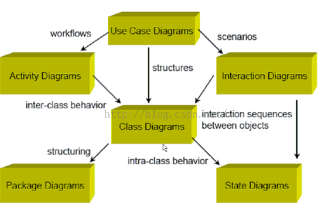
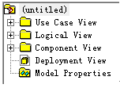

### 1、UML的九种图及其关系

**九种图：**

用例图，（类图，对象图），（顺序图，协作图），（状态图，活动图），构件图，部署图。

其对应的rose的结构为：

### 2、UML运用开发过程
 
<1> 完成Use Case Diagram& Document
 
<2> 对于比较复杂的Use Case用Activity图辅助说明
 
<3> 根据Use Case Document和ActivityDiagram，分析业务领域的概念，抽象出概念模型
 
<4> 分析概念模型，抽象出类
 
<5> 分析类的职责和关系，作出类图
 
<6> 根据类图制作Sequence、Collaboration、State Chart等各种图示
 
<7> 重复迭代5-6，直到得出最佳实践

### 3、几个rose的图例

这个是关联（关联名、角色、导航性、多重性、组合、聚合）
 
依次是：依赖，泛化（继承）和实现。
 
### 4、正向工程 & 逆向工程
 
**正向工程：**由UML图形生成java代码
 
**逆向工程：**从java代码生成UML图形